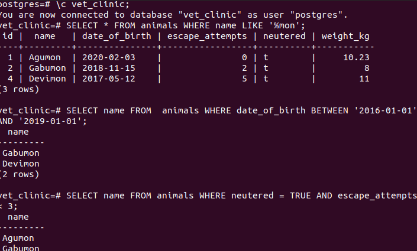

# Project Name

> In this project you will use a relational database to create the initial data structure for a vet clinic. You will create a table to store animals' information, insert some data into it, and query it.

## Screenshots:

Porject's features are added into seperate branch to keep dev safe.

## Built With

- SQL
  
## Getting Started

This repository includes files with plain SQL that can be used to recreate a database:

- Use [schema.sql](./schema.sql) to create all tables.
- Use [data.sql](./data.sql) to populate tables with sample data.
- Check [queries.sql](./queries.sql) for examples of queries that can be run on a newly created database. 

## Author

👤 **Emmanuel Gbenga**

- GitHub: [@githubhandle](https://github.com/gbengacode)

## 🤝 Contributing

Contributions, issues, and feature requests are welcome!

Feel free to check the [issues page](https://github.com/Gbengacode/vetclinic-database/issues).

## Show your support

Give a ⭐️ if you like this project!

## Acknowledgments

- Hat tip to anyone whose code was used
- Inspiration
- etc

## 📝 License

This project is [MIT](./MIT.md) licensed.
